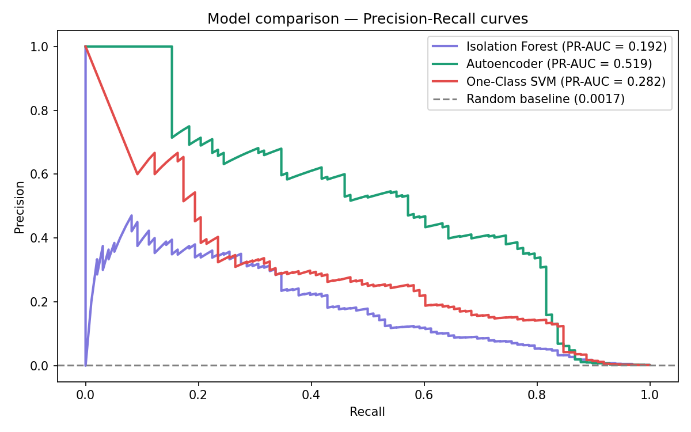

# Credit Card Fraud Detection — Anomaly Detection Comparison

Comparing three unsupervised anomaly detection approaches on the
Kaggle Credit Card Fraud dataset (284,807 transactions, 0.17% fraud rate).

## Results

| Model            | PR-AUC | ROC-AUC |
|------------------|--------|---------|
| Isolation Forest | 0.19   | 0.95    |
| Autoencoder      | 0.52   | 0.96    |
| One-Class SVM    | 0.28   | 0.94    |

## Key findings
- Autoencoder achieves best PR-AUC by learning reconstruction error on normal transactions only
- One-Class SVM catches the most fraud (89% recall) but generates 3,043 false positives — operationally unusable
- Isolation Forest is the fastest to train and best for a lightweight production baseline
- SMOTE applied only to training data to prevent data leakage
